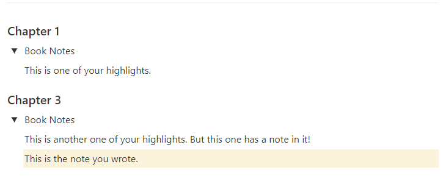

# Kindle \<Notes and Highlights> to Notion

> Parser that writes the \<Notes and Highlights> from Kindle exported HTMLs into a Notion page.

### Motivation

I have a terrible memory, so I've developed a habit of constantly highlighting passages and taking notes while reading on Kindle. However, simply highlighting and taking notes is not sufficient for me to retain the information. I've found that unless I rewrite the passages using my own words and intuition, I struggle to remember anything.

To ensure I truly comprehend and remember the content, I transcribe my Kindle notes into Notion and then write detailed summaries by myself. While transcribing the highlights may seem like a simple task, it can actually be quite tedious, even with the copy and paste functionality of Kindle.

To streamline this process and save time, I have created a small script that automates the transcription of my Kindle highlights into Notion. This script eliminates the need for manual copying and pasting, allowing me to focus more on the actual content and analysis.

## Installation

```bash
$ pip install git+https://github.com/eReverter/kindlenotionsync.git
```

## Usage

The following code will simply append the highlights and notes from the kindle export into the specified page from Notion:

```bash
$ python3 -m kindlenotionsync [-h] [-f KINDLE_FILE] [-c CREDENTIALS] [-p PAGE_ID]
```

First, you need an export from Kindle. To obtain it, download the Kindle app from Amazon and open one of your books. At the top right corner there should be a button that allows you to export the contents you ave highlighted as an *html* file. The result should be something like the [export.html](export.html) from this repository. 

Second, you will need to store your credentials in the `credentials.json` file, as exemplified in the [credentials.json](credentials.json) example file in the repository. In order to get your API key, you first need to create an [integration](https://www.notion.so/my-integrations) in Notion.

Third, you need to fetch the desired page link. You can get the link by clicking `ctrl+L` while the block containing the page is selected, or by clicking the option from the drop down menu that appears from selecting the three dots at the top right corner of Notion. The link will always refer to the current block you are selecting, so if you fetch it while inside the page, you will get the link to the page and to the current block you are selecting. In any case, you will get something like *https://www.notion.so/test-{**page_id_here**}?pvs=4*. The page id is the long string made up of alphanumeric characters. Copy it.

Finally, run the above-mentioned code and the export will get parsed, then loaded into Notion as depicted below:




## Future Work
- [ ] Allow to store the html in another format (i.e., a txt file). Just copy the code from the `kinde_parser.py` and do with it whatever you want.
- [ ] Implement some sort of summarizer (either extractive or abstractive) to automatically summarize long highlights if desired.
- [ ] Better format how the data gets loaded into Notion. 
